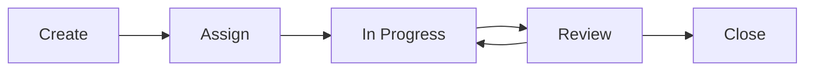

# Project Management Guide

A comprehensive guide for student teams using GitHub's native features for effective project management.

## 📋 Table of Contents

1. [Overview](#overview)
2. [Getting Started](#getting-started)
3. [Issue Workflow](#issue-workflow)
4. [Using GitHub Projects](#using-github-projects)
5. [Milestone Management](#milestone-management)
6. [Weekly Reports Integration](#weekly-reports-integration)
7. [Best Practices](#best-practices)
8. [Common Workflows](#common-workflows)
9. [Tips for Success](#tips-for-success)

## Overview

This guide helps you manage your team project using GitHub's built-in tools:
- **Issues**: Track tasks, bugs, and ideas
- **Projects**: Visualize workflow with Kanban boards
- **Milestones**: Group work toward deadlines
- **Labels**: Categorize and filter work

All tools are integrated, creating a seamless workflow from idea to implementation.

## Getting Started

### 1. Initial Setup Checklist

- [x] All team members have repository access
- [x] Project board created (see [PROJECT_TEMPLATE.md](../.github/PROJECT_TEMPLATE.md))
- [x] Labels configured (see [labels.yml](../.github/labels.yml))
- [x] First milestone created
- [x] Team roles assigned
- [x] Weekly meeting schedule set

### 2. Understanding the Tools

```
Repository
├── Issues (Tasks, Bugs, Ideas)
├── Projects (Visual Workflow)
├── Milestones (Time-based Goals)
└── Labels (Categories)
```

## Issue Workflow

### Creating Issues

1. **Choose the Right Template**
   - `task.md`: General tasks
   - `bug.md`: Problems to fix
   - `feature.md`: New functionality
   - `meeting-notes.md`: Meeting records
   - `weekly-goal.md`: Weekly objectives
   - `research.md`: Investigation tasks

2. **Write Clear Titles**
   - Bad: "Fix bug"
   - Good: "[BUG] Login button unresponsive on mobile devices"

3. **Provide Complete Information**
   - Context/background
   - Specific requirements
   - Acceptance criteria
   - Related issues/PRs

### Issue Lifecycle



#### 1. Create
- Use appropriate template
- Add relevant labels
- Link to milestone
- Estimate effort (if using story points)

#### 2. Assign
- Assign to team member(s)
- Move to "To Do" column
- Set priority label
- Add to current sprint/week

#### 3. Work
- Move to "In Progress"
- Create feature branch
- Regular commits with issue references
- Update issue with progress comments

#### 4. Review
- Create Pull Request
- Link PR to issue (use "Fixes #123")
- Request code review
- Move to "Review" column

#### 5. Close
- Merge PR (auto-closes issue)
- Or manually close with explanation
- Moves to "Done" column

### Issue Best Practices

```yaml
DO:
  - One issue per discrete task
  - Update status regularly
  - Link related issues
  - Use @ mentions for attention
  - Add screenshots when helpful

DON'T:
  - Create vague issues
  - Leave issues unassigned
  - Work without an issue
  - Close without explanation
  - Ignore stale issues
```

## Using GitHub Projects

### Project Board Structure

Our standard board has 5 columns:

| Column | Purpose | When to Move Items |
|--------|---------|-------------------|
| **Backlog** | Future work | When identified |
| **To Do** | This week's work | During planning |
| **In Progress** | Active work | When starting |
| **Review** | Needs review | PR created |
| **Done** | Completed | PR merged |

### Daily Workflow

```markdown
Morning:
1. Check "To Do" column
2. Pick highest priority unassigned item
3. Assign to yourself
4. Move to "In Progress"

During Work:
1. Update issue with progress
2. Push commits regularly
3. Ask for help if blocked

End of Day:
1. Update issue status
2. Move blocked items back
3. Comment on progress
```

### Using Views and Filters

Create custom views for:
- **My Work**: `assignee:@me`
- **This Week**: Current milestone
- **Blocked**: `label:"status: blocked"`
- **High Priority**: `label:"priority: high"`

### Automation Tips

Set up these automations:
1. Issues → "To Do" when added to project
2. Issues → "In Progress" when branch created
3. Issues → "Review" when PR opened
4. Issues → "Done" when closed

## Milestone Management

### Aligning with Course Requirements

Map course deliverables to milestones:

```
Course Timeline          GitHub Milestones
├── Week 1-2      →     Sprint 1 - Setup & Planning
├── Week 3-4      →     Sprint 2 - Core Features
├── Week 5-6      →     Sprint 3 - Enhancement
├── Week 7-8      →     Sprint 4 - Testing
├── Week 9-10     →     Sprint 5 - Polish
├── Week 11       →     MVP Release
└── Week 12       →     Final Submission
```

### Sprint Planning with Milestones

1. **Before Sprint**
   - Review upcoming milestone
   - Check course requirements
   - Estimate team capacity

2. **During Planning**
   - Move items from Backlog
   - Assign to milestone
   - Distribute among team
   - Set priority labels

3. **During Sprint**
   - Track milestone progress
   - Adjust scope if needed
   - Document blockers

4. **Sprint End**
   - Review completion
   - Move incomplete items
   - Document lessons learned

## Weekly Reports Integration

### Automated Report Generation

Our weekly reports pull data from:
- **Completed**: Issues closed this week
- **In Progress**: Open issues in milestone
- **Blockers**: Issues with blocked label
- **Next Week**: Issues in next milestone

### Report Workflow

```
Monday: Plan Week
├── Create weekly goal issue
├── Review milestone progress
└── Assign week's work

Friday: Generate Report
├── Run report script
├── Review generated content
├── Add qualitative insights
└── Submit report
```

### Linking Reports to Project Data

In your weekly report:
```markdown
## Completed This Week
- Implemented user authentication (#23, #24)
- Fixed navigation bug (#28)
- Updated documentation (#30)

## Currently Working On
- Database schema design (#31) - 70% complete
- API endpoint creation (#32) - Just started

## Blockers
- Waiting for API credentials (#29) - blocking #32
```

## Best Practices

### For Individual Contributors

1. **Daily Habits**
   - Check assigned issues
   - Update issue progress
   - Review notifications
   - Communicate blockers

2. **Weekly Habits**
   - Participate in planning
   - Review your completed work
   - Update time estimates
   - Clean up stale branches

### For Team Leads

1. **Monitoring**
   - Review board daily
   - Check milestone progress
   - Identify bottlenecks
   - Redistribute work if needed

2. **Communication**
   - Run effective standups
   - Document decisions
   - Share progress updates
   - Celebrate completions

### For the Whole Team

1. **Collaboration**
   - Review each other's PRs promptly
   - Help with blockers
   - Share knowledge
   - Maintain documentation

2. **Process Improvement**
   - Regular retrospectives
   - Adjust workflows
   - Update templates
   - Refine estimates

## Common Workflows

### Starting a New Feature

```bash
1. Create issue from feature template
2. Add to current milestone
3. Assign team member
4. Create feature branch
5. Move to "In Progress"
6. Implement feature
7. Create PR
8. Move to "Review"
9. After approval, merge
10. Auto-moves to "Done"
```

### Handling Bugs

```bash
1. Create issue from bug template
2. Add "priority: high" label
3. Assign to developer
4. Investigate and fix
5. Test thoroughly
6. Create PR with fix
7. Deploy after review
```

### Research Tasks

```bash
1. Create research issue
2. Define questions
3. Set time box
4. Document findings
5. Create decision issue
6. Implement decision
```

## Tips for Success

### 📈 Productivity Tips

1. **Batch Similar Tasks**
   - Review all PRs together
   - Update all issues at once
   - Plan week in one session

2. **Use Keyboard Shortcuts**
   - `g i` - Go to issues
   - `g p` - Go to pull requests
   - `/` - Search

3. **Automate Repetitive Tasks**
   - Use GitHub Actions
   - Create issue templates
   - Set up branch protection

### 🎯 Quality Tips

1. **Definition of Done**
   - Code reviewed
   - Tests passing
   - Documentation updated
   - Deployed successfully

2. **Code Review Checklist**
   - Functionality works
   - Code is readable
   - Tests included
   - No security issues

### 🤝 Team Harmony Tips

1. **Communication**
   - Over-communicate progress
   - Ask questions early
   - Share learning resources
   - Celebrate wins

2. **Conflict Resolution**
   - Address issues early
   - Focus on solutions
   - Involve instructor if needed
   - Document decisions

## Quick Reference

### Essential Commands

```bash
# Link PR to issue
Fixes #123
Closes #123
Resolves #123

# Reference issue
See #123
Related to #123

# Mention team
@teamname/developers
@username
```

### Useful Searches

```
# Find your work
assignee:@me is:open

# Find blocked items
label:"status: blocked"

# Find high priority
label:"priority: high" is:open

# Find stale issues
is:open updated:<2023-01-01
```

### Label Guidelines

| Label Type | When to Use | Example |
|------------|-------------|---------|
| Priority | Urgency level | `priority: high` |
| Type | Work category | `type: feature` |
| Status | Current state | `status: blocked` |
| Team | Ownership | `team: frontend` |

## Getting Help

1. **Check Documentation**
   - This guide
   - GitHub docs
   - Course materials

2. **Ask Team**
   - Post in team chat
   - Raise in standup
   - Pair programming

3. **Ask Instructor**
   - Office hours
   - Email with context
   - Include issue links

---

Remember: Good project management is about communication, consistency, and continuous improvement. Start simple, iterate often, and find what works for your team!
