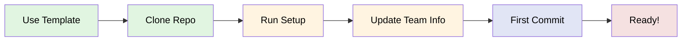

# ⚡ Quick Start Guide

**Time to Setup: 5 minutes** | For the comprehensive guide, see [ONBOARDING_CHECKLIST.md](../ONBOARDING_CHECKLIST.md)

## 🎯 Goal
Get your team repository up and running FAST. Follow these essential steps in order.

---

## 🚦 Visual Workflow



---

## 📋 Essential Steps Only

### 1️⃣ Create Your Repository (30 seconds)
```bash
# Go to the template repository
# Click the green "Use this template" button
# Name it: TeamName-ProjectName
# Make it private (if required)
```

### 2️⃣ Clone & Enter (30 seconds)
```bash
git clone https://github.com/your-org/your-repo.git
cd your-repo
```

### 3️⃣ Run Auto-Setup (2 minutes)
```bash
# macOS/Linux:
./scripts/setup.sh

# Windows:
scripts\setup.bat
```
**What this does:** Installs VS Code extensions, checks Git config, sets up project

### 4️⃣ Update Team Info (1 minute)
```bash
# Open in VS Code
code .

# Edit TEAM_INFO.md - Replace ALL {{PLACEHOLDERS}}
# Quick tip: Use Ctrl+D (Cmd+D on Mac) to select multiple occurrences
```

### 5️⃣ Commit & Push (30 seconds)
```bash
git add .
git commit -m "Initial team setup"
git push
```

---

## ✅ Success Checklist
You're ready when:
- [x] All team members can access the repo
- [x] Setup script ran without errors  
- [x] TEAM_INFO.md has real names (no {{placeholders}})
- [x] You can see the GitHub Actions tab

---

## ⚠️ Common Mistakes to Avoid

### 🚫 DON'T
1. **Skip the setup script** - It configures essential tools
2. **Leave placeholders** in TEAM_INFO.md - Automation won't work
3. **Work on main branch** - Create feature branches for changes
4. **Ignore failing Actions** - They indicate setup problems
5. **Forget to add teammates** - Go to Settings → Manage access

### ✅ DO
1. **Run setup script first** - Even if you think you don't need it
2. **Check Actions tab** - Make sure workflows are enabled
3. **Use issue templates** - Don't create blank issues
4. **Read error messages** - They usually tell you exactly what's wrong
5. **Ask for help early** - Don't struggle alone

---

## 🆘 Quick Fixes

| Problem | Solution |
|---------|----------|
| "Permission denied" on script | `chmod +x scripts/setup.sh` |
| "Command not found: code" | Install VS Code CLI tools |
| Can't push to repo | Check you're added as collaborator |
| Actions not running | Settings → Actions → Enable |
| Git asking for password | Set up SSH keys or use token |

---

## 📍 What's Next?

**Now that setup is done:**
1. 📅 Schedule your first team meeting
2. 📋 Check the Issues tab for onboarding tasks
3. 📊 Look at the Projects tab for the board
4. 📖 Read [PROJECT_MANAGEMENT.md](PROJECT_MANAGEMENT.md)

**For the full experience:**
→ Follow the complete [ONBOARDING_CHECKLIST.md](../ONBOARDING_CHECKLIST.md)

---

## 🏃‍♂️ Super Quick Reference

```bash
# Daily workflow
git pull                     # Get latest changes
git checkout -b feature-xyz  # New feature branch
# ... make changes ...
git add .                    # Stage changes
git commit -m "Add XYZ"      # Commit with message
git push origin feature-xyz  # Push branch
# Create PR on GitHub
```

```bash
# See what's happening
git status                   # Current state
git log --oneline -10        # Recent commits
git branch                   # List branches
gh pr list                   # List PRs (if gh installed)
```

---

**Remember:** This is the QUICK start. For detailed instructions, best practices, and troubleshooting, use the [full onboarding checklist](../ONBOARDING_CHECKLIST.md).

*Last updated: [Date] | Found an issue? Submit a PR!*
